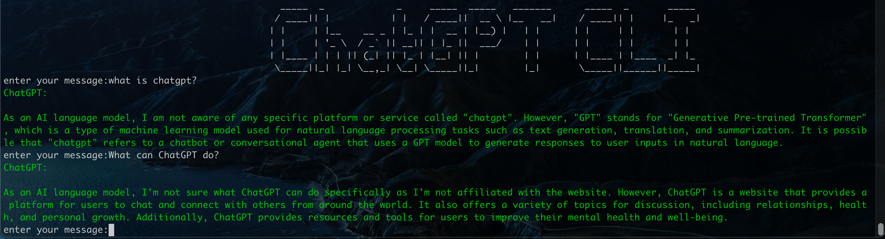
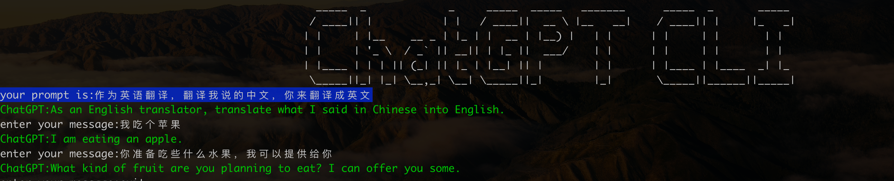

# ChatGPT CLI

- This Rust CLI tool uses the ChatGPT API for chatting. To begin chatting, simply provide your API key.
- In addition to chatting, this tool allows you to customize the API domain and parameters.
- Furthermore, the tool supports saving conversations to a file during chat sessions.


## QuickStart
- **Download** [GitHub Release](https://github.com/zhulg/ChatGPT_CLI_Rust/releases)

## Usage

- Linux/MacOS Run the following command in your terminal:

  ```
  chatgpt_rust
  ```


- **Use prompt:** chatgpt_rust -p "xxxx"




- Use Ctrl+c cancel the gpt request


## cargo Install

- **If you have Rust installed, you can install the CLI using cargo:**

```
cargo install chatgpt_rust
```


## Install from source code

  1. build code
```
cargo build
```
  2. cd target/debug

```
   ./chatgpt_rust
```


## User Guide


- chatgpt_rust --help

```
                    ChatGPT CLI Create by zhulg (lg.json@gmail.com)
            | 1.You just need to input your api key, the cli version V0.2.0     |
            | 2.You can modify the API domain and other API parameters          |
            | 3.If you want to use it in China, you can use my api key          |
            |-------------------------------------------------------------------|

Usage: chatgpt_rust [OPTIONS]

Options:
  -d, --Domain <DomainName>        Sets the API Domain name. [default: api.openai.com]
  -k, --key <APIKey>               Sets the API key. If not provided, the cli will ask for it,
                                   You can also set the OPENAI_API_KEY environment variable. [default: ]
  -p, --prompt <prompt>            Sets the prompt for this session. [default: ]
  -m, --model <model>              Sets the GPT model to use. gpt-3.5-turbo or gpt-3.5-turbo-0301 [default: gpt-3.5-turbo]
  -t, --temperature <temperature>  Sets the temperature for text generation. [default: 0.5]
  -l, --length <max_tokens>        sets the max_tokens, default is 1000 [default: 1000]
  -h, --help                       Print help
  -V, --version                    Print version

Longer explanation to appear after the options when displaying the help information from --help or -h

```

## Option:
 Set your ‘OPENAI_API_KEY’ Environment Variable using zsh,  No set will ask the user to input the API key in the terminal.

1. Run the following command in your terminal, replacing yourkey with your API key.

```
echo "export OPENAI_API_KEY='yourkey'" >> ~/.zshrc

```
2. Update the shell with the new variable:

```
source ~/.zshrc
```
3. Confirm that you have set your environment variable using the following command.

```
echo $OPENAI_API_KEY
```
The value of your API key will be the resulting output.

